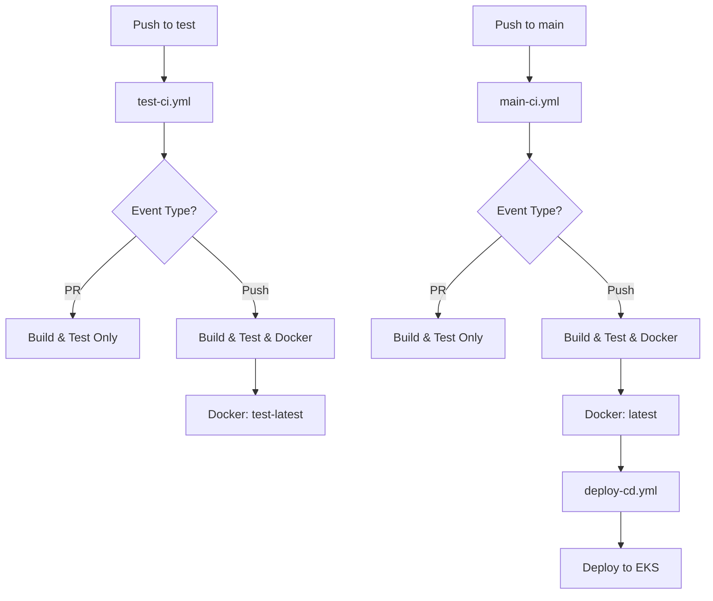

# GitHub Actions Workflows

## 📋 Tổng quan

Project này sử dụng 3 workflows chính:

1. **main-ci.yml** - CI cho production (main branch)
2. **test-ci.yml** - CI cho testing (test branch)
3. **deploy-cd.yml** - CD cho production deployment

---

## 🔄 Workflow Strategy

### Branch Strategy

```
test branch (development)
    ↓
    ↓ (test-ci.yml runs)
    ↓ Build → Test → SonarCloud → Docker (test-latest)
    ↓
    ↓ (merge when ready)
    ↓
main branch (production)
    ↓
    ↓ (main-ci.yml runs)
    ↓ Build → Test → SonarCloud → Docker (latest)
    ↓
    ↓ (deploy-cd.yml runs automatically)
    ↓
EKS Production
```

---

## 1. main-ci.yml (Production CI)

**Trigger:**
- Push to `main` branch
- Pull Request to `main` branch

**Jobs:**
1. **backend-ci**: Build và test backend
   - Maven build
   - Run tests
   - SonarCloud analysis
   - Upload JAR artifact

2. **frontend-ci**: Build và test frontend
   - npm install
   - npm build
   - Upload dist artifact

3. **build-docker**: Build Docker images (chỉ khi push)
   - Build backend image
   - Build frontend image
   - Tag: `latest` và `YYYYMMDD-HHMMSS-{sha}`
   - Push to Docker Hub
   - Save image tag cho CD

**Điều kiện build Docker:**
```yaml
if: github.event_name == 'push' && github.ref == 'refs/heads/main'
```

**Output:**
- Docker images với tag `latest`
- Image tag artifact cho CD pipeline

---

## 2. test-ci.yml (Test CI)

**Trigger:**
- Push to `test` branch
- Pull Request to `test` branch

**Jobs:**
Giống main-ci.yml nhưng:
- Docker images tag: `test-latest` và `test-YYYYMMDD-HHMMSS-{sha}`
- Không trigger CD pipeline
- Dùng để test trước khi merge vào main

**Điều kiện build Docker:**
```yaml
if: github.event_name == 'push' && github.ref == 'refs/heads/test'
```

**Use case:**
- Test code changes trước khi merge
- Verify CI pipeline
- Build test images để test thủ công

---

## 3. deploy-cd.yml (Production CD)

**Trigger:**
- Tự động sau khi main-ci.yml hoàn thành thành công
- Hoặc manual dispatch

**Jobs:**
1. **deploy-production**: Deploy to EKS
   - Download image tag từ CI
   - Configure kubectl
   - Update ConfigMap với DB/NFS IPs
   - Update Secrets với passwords
   - Update Deployments với new image tags
   - Apply HPA và Ingress
   - Wait for rollout
   - Get ALB URL

**Requirements:**
- CI pipeline phải hoàn thành thành công
- GitHub Secrets phải được cấu hình đầy đủ

---

## 🔧 GitHub Secrets Required

### For CI (main-ci.yml, test-ci.yml)
```
DOCKER_USERNAME          # Docker Hub username
DOCKER_PASSWORD          # Docker Hub password
SONAR_TOKEN             # SonarCloud token
SONAR_ORGANIZATION      # SonarCloud organization
SONAR_PROJECT_KEY       # SonarCloud project key
```

### For CD (deploy-cd.yml)
```
AWS_ACCESS_KEY_ID       # AWS access key
AWS_SECRET_ACCESS_KEY   # AWS secret key
AWS_REGION              # AWS region (e.g., ap-southeast-1)
EKS_CLUSTER_NAME        # EKS cluster name
DATA_SERVER_IP          # Database private IP
DB_PASSWORD             # Database password
```

---

## 📝 Usage Examples

### Scenario 1: Development on test branch

```bash
# 1. Create feature branch from test
git checkout test
git pull origin test
git checkout -b feature/new-feature

# 2. Make changes
# ... code changes ...

# 3. Commit and push
git add .
git commit -m "Add new feature"
git push origin feature/new-feature

# 4. Create PR to test branch
# GitHub → Pull Requests → New PR
# base: test ← compare: feature/new-feature

# 5. test-ci.yml runs automatically
# - Build and test
# - SonarCloud analysis
# - No Docker build (PR only)

# 6. Merge PR to test
# test-ci.yml runs again
# - Build Docker images with test-latest tag

# 7. Test manually if needed
docker pull your-username/productx-backend:test-latest
docker pull your-username/productx-frontend:test-latest
```

### Scenario 2: Deploy to production

```bash
# 1. Create PR from test to main
git checkout test
git pull origin test
# GitHub → Pull Requests → New PR
# base: main ← compare: test

# 2. main-ci.yml runs on PR
# - Build and test
# - SonarCloud analysis
# - No Docker build (PR only)

# 3. Review and merge PR

# 4. main-ci.yml runs on push to main
# - Build and test
# - Build Docker images with latest tag
# - Save image tag

# 5. deploy-cd.yml runs automatically
# - Deploy to EKS production
# - Update with new images
```

### Scenario 3: Hotfix on production

```bash
# 1. Create hotfix branch from main
git checkout main
git pull origin main
git checkout -b hotfix/critical-bug

# 2. Fix bug
# ... code changes ...

# 3. Commit and push
git add .
git commit -m "Fix critical bug"
git push origin hotfix/critical-bug

# 4. Create PR to main
# base: main ← compare: hotfix/critical-bug

# 5. Merge and deploy
# main-ci.yml → deploy-cd.yml runs automatically
```

---

## 🐛 Troubleshooting

### Issue: Docker build job skipped

**Symptom:**
```
build-docker: This job was skipped
```

**Cause:**
- Workflow triggered by PR (not push)
- Wrong branch (not main/test)

**Solution:**
- Merge PR to trigger push event
- Check branch name matches workflow trigger

### Issue: CD pipeline not triggered

**Symptom:**
- CI completes but CD doesn't run

**Cause:**
- CI failed (CD only runs on success)
- workflow_run trigger not configured

**Solution:**
- Check CI logs for errors
- Verify deploy-cd.yml trigger configuration

### Issue: Image tag not found

**Symptom:**
```
Error: artifact 'image-tag' not found
```

**Cause:**
- Docker build job was skipped
- Artifact expired (7 days retention)

**Solution:**
- Re-run CI pipeline
- Check Docker build job ran successfully

---

## 📊 Workflow Visualization



---

## 📚 References

- [GitHub Actions Documentation](https://docs.github.com/en/actions)
- [Docker Build Push Action](https://github.com/docker/build-push-action)
- [AWS Actions](https://github.com/aws-actions)

---

**Last Updated:** 2024-01-10
